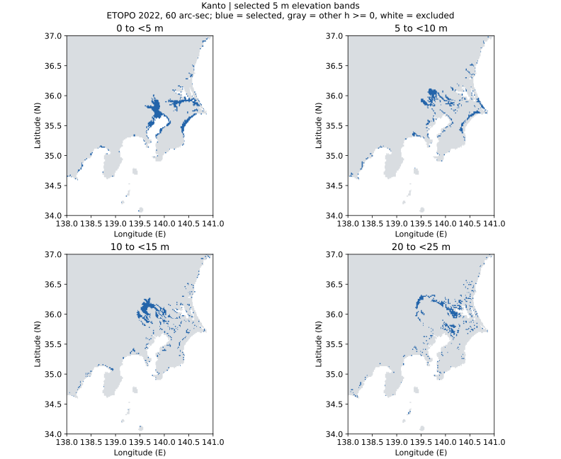

# layered-earth

実在DEMを5m標高帯に分け、連結成分・面積・接触グラフを解析する地域プロトタイプ。

**Status:** NOAA ETOPO実データによる関東周辺の解析・画像生成済み。全球解析は未対応。

## 初回実データ結果

[画像付き実験ノート・集計CSV・再現手順](docs/results/kanto/README.md)



東経138–141°・北緯34–37°。60秒角・標高0m以上18,350セルを分類すると、
4近傍で14,563成分、8近傍で13,475成分。これはDEM上の連結成分であり、現実の島の数ではない。

## Run

```bash
python -m pip install -e '.[geo,test]'
python -m unittest discover -s tests -v
layered-earth --dem data/region.tif --source 'DATASET_URL' \
  --band-height 5 --connectivity 4 --output outputs/region
```

`outputs/region/results.md` にPNG/SVGの結果画像、CSVへのリンクを自動生成する。
実データ取得後、検証済み出力を `docs/results/` にコピーしてコミットできる。
元DEMはGit管理しない。出典・パラメータ・SHA-256は `provenance.json` に残す。

GeoTIFF: 単一バンド、非回転EPSG:4326、標高単位m、経度は昇順。
NPZ: `h` (行×列)、`lon_edges` (列+1)、`lat_edges` (行+1)、任意のboolean `mask`。
海抜0m以上という初期フィルタは陸海判定ではない。負標高も解析する場合は
`--min-elevation -500` 等を明示する。

[数理モデル・限界・研究計画](docs/model.md)
